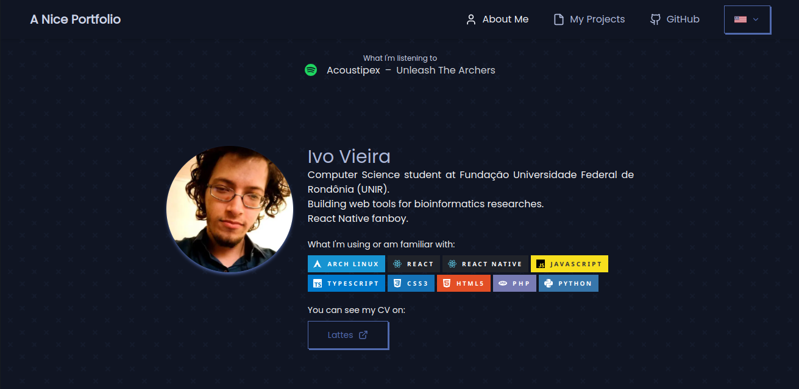

# Ivo's Portfolio

Hey there, I'm Ivo and this is the source code to my portfolio on [ivo.vist.gg](https://ivo.vist.gg/).

Here's what this is using

- `next.js` for React framework
- `tailwindcss` for styling
- `next-i18next` for internationalization (EN and PT-BR)
- `swr` for external requests (Spotify)
- `plaiceholder` for blurring images on load
- `svg-country-flags` for, well, country flags

The only environment variables you need to set are those related to Spotify. If you don't need it, just remove the `<NowPlaying />` block from `src/pages/_app.tsx`.

Almost all code is in TypeScript, some config files are in JavaScript (can I call it 100% TS?).